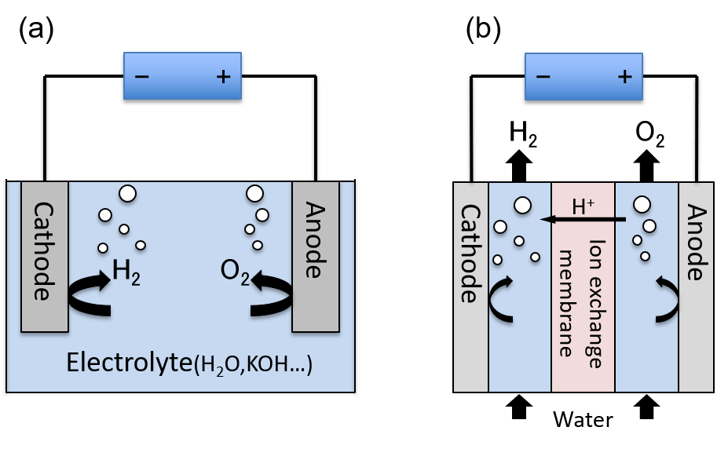

# 研究内容

## 研究手法や対象

理論計算による化学の研究を行なっています。手法としては、第一原理計算（固体）や、分子軌道法（分子）がメインです。
対象は、固体やその表面の物性の計算が中心です。

##  キーワード

第一原理計算, 分子軌道法, 密度汎関数法, 固体化学, 表面化学, 触媒設計, 水分解

## 研究内容について

主に固体の触媒の物性を研究しています。ここでは研究内容の詳細よりはもう少し引いた背景の部分について説明します。

### 人工光合成システムの実現

現在、人工光合成と呼ばれる技術の実現・普及を目指し、そのためのシステムや触媒が世界中の研究機関で研究されています。
人工光合成技術はその名前の通り、植物の光合成が行なっている以下の反応を人工的に行おうとする技術です。

- 水(H2O)を分解して水素(H2)や酸素(O2)を発生させる。

- 二酸化炭素(CO2)を、メタン(CH4)・エタノール(C2H5OH)などの有用な化合物に変換する。

以上の反応は、どちらも電気分解を使って行うことができます。
しかし、これらの反応を行うためには、その活性化エネルギー（電気分解の文脈では、「過電圧」と言われます）に相当するエネルギーを余分に投入する必要があります。
この活性化エネルギーは、用いる触媒によって変化しますが、一般に可視光のエネルギーよりも高くなり、単純に太陽光由来のエネルギーだけを用いて水分解を行うことは困難です。

植物の光合成システムは、上記の反応を全て太陽光のエネルギー（680 nm程度）で行うことができ、これと同程度、もしくはこれより高効率な触媒を実現することが人工光合成技術の確立に求められる目標です。

ここで、電気分解の簡単な構成図を示します。 (a)は最も簡単な装置で、(b)は水分解システムの実験などで使われるPEM型水分解装置と呼ばれるものです。(a)の場合は、陽極(Anode)で発生する酸素(O2)と陰極(Cathode)で発生する水素(H2)の分離が困難ですが、(b)のPEM型装置では、両極の間にイオン交換膜を挿入しており、気体の分離が容易になっています。

{: style="height:200px"}

このAnodeやCathodeに用いる電極が反応性を決めることになるため、この電極材料は電極触媒と呼ばれます。現在探索されている電極触媒に対する要請としては、単に高効率であるだけでなく、安価な金属（白金などの高価な金属ではない）を用いた材料であることなどが挙げられます。我々は、主に3d遷移金属(マンガン、鉄、コバルト、ニッケルなど）の酸化物を対象としつつ、実験系のグループと協力しながら、「良い触媒に求められる性質は何か」という点を、理論計算を使いながら解明しようとしています。

<!---
### これまでに書いた論文

3d遷移金属の中でも、鉄は特に地球上に豊富に存在し安価な金属です。一方で、鉄は多くの価数を取ることができるため、同一の組成式をもちつつも構造が異なる結晶構造（結晶多形）が多く、しかも結晶性が低いことから、触媒としての性質を

しかし、これらの触媒の反応機構を論じた論文は、表面の構造についての議論が十分になされないままのものが多い状況でした。

2019年に我々が書いた論文では、鉄酸化物の一種である鉄オキシ水酸化物の２種類の結晶多形を題材として、その表面の電子の性質を計算しました。その結果、同じ組成の結晶で、鉄原子の価数を同じと仮定した上でも、内部・表面の構造の違いによって、価電子や伝導体のとるエネルギーは定性的に大きく異なることを示しました。

--->
